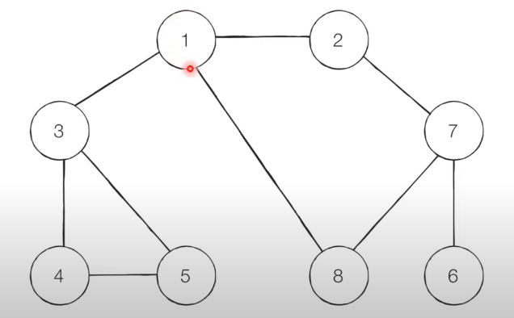

# 중요 파라미터
- cur
- target
- visited
- edges

###
- 첫번째 경로를 찾으면 템플릿은 멈춤 (최단경로가 아닐 수도 있다)
- 매개 변수를 하나 더 추가하여 이미 찾은 최단 경로를 나타낸다.

### DFS - 스택 자료 구조(혹은 재귀함수)
- 핵심 원리
  1. 탐색 시작 노드를 스택에 삽입하고 방문 처리를 한다.
  2. 스택의 최상단 노드에 방문하지 않은 인접한 노드가 하나라도 있으면
  그 노드를 스택에 넣고 방문 처리한다.   
  방문하지 않은 인접 노드가 없으면 스택에서 최상단 노드를 꺼낸다.
  3. 더 이상 2번의 과정을 수행할 수 없을 때까지 반복한다.

- 문제에 인접한 노드의 방문 기준이 있다.
- 예시1
  
  1. 시작 노드인 '1'을 스택에 삽입하고 방문처리   
      방문처리는 visited 배열에 넣는다는 이야기
  2. 스택의 최상단 노드인 '1'에 방문하지 않은 인접 노드 '2', '3', '8'이 있다.   
      이 중에서 가장 작은 노드인 '2'를 스택에 넣고 방문처리를 한다.
  3. 스택의 최상단 노드인 '2'에 방문하지 않은 인접 노드 '7'이 있다.   
      '7' 노드를 스택에 넣고 방문처리 한다.
  4. 스택의 최상단 노드인 '7'에 방문하지 않은 인접 노드 '6, '8'이 있다.   
      이 중에서 가장 작은 노드인 '6'을 스택에 넣고 방문처리한다.
  5. 스택의 최상단 노드인 '6'에 방문하지 않은 인접 노드가 없다.   
      따라서 스택에서 '6' 노드를 꺼낸다.
  6. 스택의 최상단 노드인 '7'에 방문하지 않은 노드 '8'이 있다.   
      '8' 노드를 스택에 넣고 방문처리한다.
  7. 스택의 최상단 노드인 '8'에 방문하지 않은 인접 노드는 없다.   
      따라서 스택에서 '8' 노드를 꺼낸다.
  8. 스택의 최상단 노드인 '7'에 방문하지 않은 인접 노드는 없다.   
      따라서 스택에서 '7' 노드를 꺼낸다.
  9. 스택의 최상단 노드인 '2'에 방문하지 않은 인접 노드는 없다.   
      따라서 스택에서 '2' 노드를 꺼낸다.
  10. 스택의 최상단 노드인 '1'에 방문하지 않은 인접 노드 '3'이 있다.   
      '3' 노드를 스택에 넣고 방문처리한다.
  11. 스택의 최상단 노드에 '3'에 방문하지 않은 인접 노드 '4', '5'이 있다.   
      이 중에서 가장 작은 노드인 '4'를 스택에 넣고 방문처리를 한다.
  12. 스택의 최상단 노드인 '4'에 방문하지 않은 인접 노드 '5'이 있다.      
      '5' 노드를 스택에 넣고 방문처리 한다.
  13. 스택의 최상단 노드인 '5'에 방문하지 않은 인접 노드는 없다.   
      따라서 스택에서 '5' 노드를 꺼낸다.
  14. 스택의 최상단 노드인 '4'에 방문하지 않은 인접 노드는 없다.   
      따라서 스택에서 '4' 노드를 꺼낸다.
  15. 스택의 최상단 노드인 '3'에 방문하지 않은 인접 노드는 없다.   
      따라서 스택에서 '3' 노드를 꺼낸다.
  16. 스택의 최상단 노드인 '1'에 방문하지 않은 인접 노드는 없다.   
      따라서 스택에서 '1' 노드를 꺼낸다.

```python
# 각 노드가 연결된 정보를 표현 (2차원 리스트)
graph = [
  [], # 노드의 번호가 1번부터 시작하여 0번 인덱스는 비어있는 경우가 있다.
  [2,3,8], #1번 노드와 연결되어 있는 것이라고 생각하면 된다.
  [1,7],
  ...
]

# 각 노드가 방문된 정보를 표현 (1차원 리스트)
visited = [False] * 9
  # - False로 해놓아서 처음에는 아무것도 방문하지 않은 것으로 표현
  # - 1~8번 노드를 가지고 있기 때문에 인덱스 0을 사용하지 않기 위해 일부러 하나를 더 큰 크기로 리스트를 만든다.

# DFS 메서드 정의
def dfs(graph, v, visited):
  # 현재 노드를 방문 처리
  visited[v] = True
  print(v, end=' ')
  # 현재 노드와 연결된 다른 노드를 재귀적으로 방문
  # 위의 2번과정 반복
  for i in graph[v]:
    if not visited[i]:
      dfs(graph, i, visited)

def(graph, 1, visited)
```
