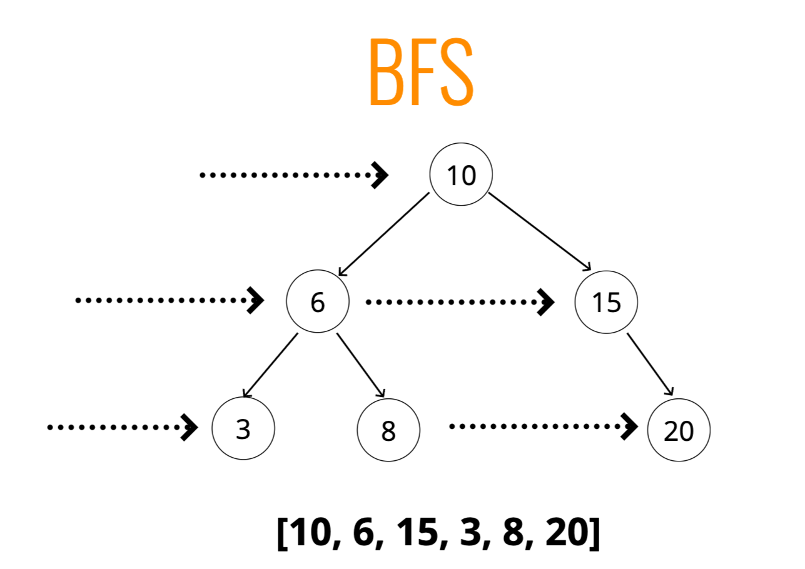
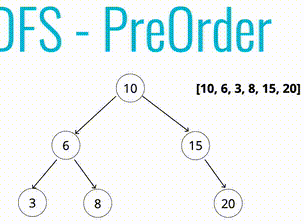
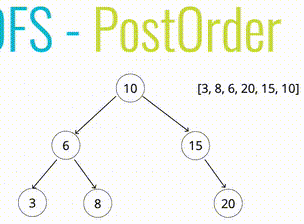
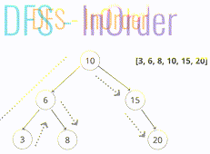

# Traversing a Tree
## Breadth-first Search : BFS
- 너비 우선 탐색 ➡️
- 맨 처음에서 시작을 해서 기본적으로 트리를 가로질러서 작업

- 선입선출의 queue로 
- 큐를 만들어서 요소들을 추적
- 그리고 데이터의 리스트를 만들어서 방문한 노드를 추적
- 루트에서 시작하여 큐에 루트를 추가 (할 일을 적어놓은 목록이라 생각하면 됨)
- ------ 루프(큐에 값이 있는 동안)-------
- 그리고 루프를 돈다. 큐에 무언가가 들어있나 확인
- 큐에 무언가가 있으면 선입선출로 먼저 들어온 것을 visited 목록에 넣어준다.
- 방금 들어온 visited 항목의 왼쪽값이 있는지 확인한다.
- 왼쪽값이 있다면 그 값을 큐에 넣어준다.
- 왼쪽값이 없다면 오른쪽값을 확인한다.
- 오른쪽값이 있다면 그 값을 큐에 넣어준다.
- 오른쪽값이 없다면 루프문 종료
- 그리고 다시 루프를 돈다. 큐에 가장 먼저 온 것을 제거해준다.
- ------ 루프의 값이 없으면 종료-------
- 방문한 리스트를 리턴한다.

## Depth-first Search : DFS
- 깊이 우선 탐색 ⬇️
- 모든 노드를 방문하거나 순회할 때 
  형제 노드로 넘어가기 전에 수직으로 트리의 끝까지 내려간다.

- 전위순회 : preOrder
- 
- 루트 노드를 확인하고 루트노드의 왼쪽의 모든 노드를 확인하고 오른쪽 모든 노드를 확인하는 방식
- 방문한 노드를 리스트 형태로 저장한다.
- BST의 current 변수에 루트를 저장한다.
- traverse(노드) 함수를 생성한다.
  - 방문한 노드 리스트에 받은 노드를 추가한다 (즉, 여기를 방문했다)
  - 노드가 left 프로퍼티를 가지고 있다면 재귀 방식으로 traverse(left) 함수 호출 
  - 노드가 right 프로퍼티를 가지고 있다면 재귀 방식으로 traverse(right) 함수 호출
- traverse(루트) 함수를 호출하여 루트부터 방문을 한다.
- 방문한 노드를 리턴한다.

- 후위순회 : PostOrder
- 
- 정위순회와 비슷하지만 하위노드를 먼저 방문하는 방식
- 왼쪽은 본 후 오른쪽을 보고 방문한 노드 리스트에 받은 노드를 추가한다.

- 중위순회 : InOrder
- 

### 전위, 후위, 중위 순회
- 전위 : 값을 먼저 리스트에 넣고 왼쪽-오른쪽을 본다
- 후위 : 왼쪽-오른쪽으로 보고 값을 리스트에 넣는다.
- 중위 : 왼쪽을 보고 리스트에 넣고 오른쪽을 본다.

## BFS와 DFS는 언제 사용되는가?
- 시간복잡도는 비슷하다. 다만, 공간복잡도를 생각해야한다.
- 완전히 펼쳐져서 넓게 펴진 상태로 아래까지 뻗어나가는 트리는 
  - 너비 우선 탐색을 사용하면 모든 노드를 저장하기 위해 큐를 사용한다.
    - 그래서 많은 공간을 차지하게 된다.
  - 깊이 우선 탐색을 사용하면 더 적은 공간을 점유한다.

## DFS의 3가지 순회는 언제 사용되어야하는가?
